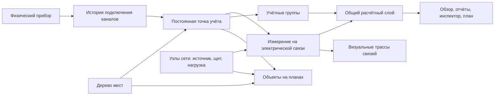

# ТЗ: структура учёта, электрическая сеть, планы и дашборд

Редакция 1.0 · 10 сентября 2026 г. · проект `wb-energy-meter`.

Документ предназначен для агента, который будет реализовывать изменения. Это спецификация целевой системы, а не описание уже реализованных возможностей.

**Согласованные с пользователем границы:** обычная сеть «вводы → щиты → потребители»; до 100 точек учёта и 10 планов. Резервные источники предусмотреть в модели, но АВР, ДГУ и переключение источников не реализовывать в первой версии. Работа локально на Wiren Board 8.x, без обязательного интернета.

Основа аудита: рабочее дерево версии 0.11.1, базовый коммит `56aade2f3c24bc910c5f12e133e8105ecf3ab689`; исходный документ `wb_energy_meter_architecture_TZ.md` из Downloads пользователя. Исходный документ рассмотрен как проектное предложение. Его раздел «Задача агенту» не был командой менять программу в ходе этого аудита.

## 1. Основное решение

Ввести постоянную **точку учёта** и разделить три независимых вопроса:

| Вопрос пользователя | Модель | Что определяет |
|---|---|---|
| Где установлен прибор и где находится объект? | Дерево мест | Площадка, корпус, этаж, помещение, место установки |
| Откуда получает питание линия? | Электрическая сеть | Источник, щит/шина, отходящая линия, потребитель |
| Куда отнести расход? | Учётные группы | Арендатор, производство, назначение, центр затрат |

Прибор поставляет измерения. Точка учёта связывает измерение с постоянным электрическим сечением. План и однолинейная схема показывают существующие сущности. Геометрия не создаёт электрические зависимости и не определяет сумму энергии.

**Главный принцип расчёта:** итог объекта нельзя получать суммой всех видимых счётчиков. Счётчик ввода уже содержит расход своих дочерних линий. Итог, детализация и небаланс — три разных результата с явным составом.



Пример: прибор стоит в ЩР-1 на первом этаже, измеряет линию серверной на втором этаже и относится к группе «ИТ». Место установки, потребитель и группа сохраняются отдельно. Перетаскивание его значка на картинке не меняет ни один из этих трёх фактов.

## 2. Что принять и что изменить в предыдущем ТЗ

| Предложение исходного документа | Решение этой редакции | Причина |
|---|---|---|
| `meter` отдельно от `metering_point`, история замен, §6 | Принять и дополнить каналами/интервалами | Один корпус прибора не всегда равен одной измеряемой цепи |
| Независимые места, группы и электросеть, §7–12, §17 | Принять | Не смешивать физическое положение и принадлежность расхода |
| Группа из одного элемента разрешена, но не обязательна, §10 | Принять | Одиночную точку можно использовать сразу |
| Универсальные объекты плана и повторные представления, §14–15 | Принять с проверяемыми ссылками | Несколько изображений одной сущности не создают новые показания |
| Нормализовать все координаты, §16, §31.4 | Заменить версионируемыми пиксельными координатами | Масштабирование окна не требует миграции; нормализация не решает обрезку, поворот и ошибку оси Y |
| Много самостоятельных деревьев учёта, §12 | Первоначально одно дерево мест и группы с категориями | Для 100 точек отдельный конструктор любых иерархий избыточен |
| Суммы вложенных групп, §9, §29 | Дополнить контролем электрического перекрытия | Уникальность ID предотвращает только повтор одного элемента, но не сумму «ввод + его потребитель» |
| Загрузка линии: 70/90% как нормальная/критическая, §18 | Сделать настраиваемыми информационными порогами | 90% номинала само по себе не доказывает аварию; неизвестный ток нельзя заменять мощностью соседней группы |
| Перенос старых связей в электросеть, §31.5 | Только после подтверждения смысла каждой связи | Из рисунка между группами нельзя достоверно вывести питающую линию |
| Однолинейный редактор, §27 | Простой редактор той же сети на отдельном холсте | Полный CAD и автоматическая трассировка не нужны для первой поставки |
| Сначала множество сущностей, миграция ближе к концу, §36 | Проверка миграции и расчётов до нового UI | Иначе красивый интерфейс будет опираться на недостоверные итоги |

Эта редакция также добавляет отсутствующие контракты качества данных, времени, источников расчёта, миграции, API, конкретные экраны и численные сценарии приёмки.

## 3. Фактическая исходная реализация

Ниже перечислены выводы из кода; это не утверждение о поведении проверенного живого контроллера.

| Наблюдение | Источник в репозитории | Следствие для разработки |
|---|---|---|
| У `meters` только один `group_id`; история энергии привязана к прибору | `migrations/001_initial_schema.sql:19`, `consumption.py:151` | Нужны постоянные точки и история привязок |
| В БД уже есть `meter_groups.parent_id`, но создание делает плоскую группу | `migrations/001_initial_schema.sql:12–16`, `repo.py:156–178` | Не дублировать колонку; реализовать проверки и API дерева |
| Сводки используют весь MQTT registry, план — все строки реестра; составы различаются | `mqtt_client.py:134–145`, `api.py:493–530,1675–1717` | Единый состав активных зарегистрированных точек; обнаруженные устройства отдельно |
| Синхронизация registry добавляет/обновляет, но не удаляет старые состояния | `model.py:193–211` | MQTT-остаток не должен возвращать удалённый объект в финансовый/энергетический итог |
| На плане группа может иметь только одну зону; концы линии — зоны | `migrations/004_site_plan.sql:19–43` | Нужны независимые объекты плана и электрические связи |
| Удаление группы каскадно удаляет зону и её линии | `migrations/004_site_plan.sql:22,34–35` | Удаление рисунка и архивирование предметной сущности разделить |
| Отчёт баланса суммирует все приборы по ролям `input/consumer` | `api.py:754–813` | Заменить явными границами баланса; роль не описывает вложенность |
| При неполных данных численный небаланс всё равно вычисляется | `api.py:769–806` | Главный итог/небаланс должны иметь строгую семантику `null` |
| У линии ток берётся по максимуму доступных фаз; возможна подстановка мощности группы для отображения | `api.py:1733–1769` | Проверять полноту нужных фаз и реальную связь измерения с линией |
| Гибридный расчёт допускает покрытие от 80% часовых строк | `consumption.py:219–236` | Отсутствующие часы и плохое качество нельзя выдавать за полный период |
| Сброс определяется по разности конечного и начального значений | `consumption.py:96–105` | Проверять и внутренние падения накопителя, даже если итоговая разность положительна |
| Пиксели описаны как Y вниз, но адаптер возвращает `[y,x]` без инверсии | `plan_geo.py:1–35` | Проверить экранную ориентацию по угловым меткам, не только обратимость функции |
| Фиксированный viewport 1100, единый HTML с Alpine/Leaflet | `static/index.html:6`, `AGENTS.md` | Сохранить стек, сделать адаптивность и общий контекст экранов |
| Миграции выполняются через `executescript`; полноценный протокол новой миграции отсутствует | `db.py:106–126` | Явно обеспечить транзакцию, резервную копию и повторный запуск |

Существующие возможности не выкидывать: реестр, статусы и инциденты, расходы, сравнение периодов, экспорт, словарь каналов, самообновление, диагностику Uptime, `/health`, `/api/selfcheck` и заглушку запуска.

## 4. Модель предметной области

### 4.1. Прибор, поток измерений и точка учёта

`meter` — физический экземпляр прибора с неизменяемым внутренним ID. `device_id` MQTT и серийный номер — атрибуты идентификации, а не универсальные вечные ключи. Смена адреса не создаёт новый объект учёта. Повторное использование MQTT-имени другим прибором оформляется заменой с временной границей.

При замене сохраняется `point_id`, но создаётся **новый `meter_id`**. Старый ID остаётся у снятого прибора вместе с его агрегатами. Ввести `meter_sources(id, meter_id, controller_key, device_id, valid_from, valid_to)`: одна MQTT-адресация в данный момент относится к одному физическому экземпляру, а несколько непересекающихся фазных bindings могут ссылаться на этот source. Уникальность текущей пары `(controller_key,device_id)` обеспечить на `meter_sources`, а не на `point_bindings`. Глобальный `UNIQUE` старого `meters.device_id` убрать проверенной миграцией с сохранением ID/FK; старое поле остаётся только legacy-атрибутом, поиск текущего прибора идёт через `meter_sources`. Не переименовывать снятому прибору MQTT ID выдуманным суффиксом ради уникальности.

Смена MQTT-адреса того же физического прибора закрывает старый source-интервал и открывает новый с тем же `meter_id`. `point_binding` фиксирует нужный source и профиль для своего интервала. Не переписывать серийник автоматически при приходе другого значения: обнаружить конфликт идентичности и предложить замену/проверку. Старые `get_by_device_id/update/remove` и запись serial в `repo.py` должны быть переведены на разрешение активного source либо постоянного ID.

`metering_point` — постоянное измеряемое сечение: «Ввод ЩР-12», «Линия серверной». Основные поля: `id`, уникальный в объекте `code`, `name`, `description`, `installation_location_id`, `installation_note`, `archived_at`. У точки может временно не быть прибора и рисунка.

`installation_location_id`, `served_location_ids`, текущий `parent_id` и `enabled` в API — read-only-проекции интервальных отношений/состояния на выбранную дату. Их нельзя поддерживать вторыми независимыми редактируемыми колонками. Канонические данные — соответствующие временные таблицы из §6; изменение через API вызывает сервис записи новой версии.

Участие точки в активном составе задаётся её собственным версионируемым `enabled`; это отдельно от опроса/отключения физического прибора. Активная точка с отключённым источником остаётся обязательным измерением с недоступными данными. Архивирование/вывод точки из учёта действует с даты, сохраняя прежние периоды.

Связь `point_binding`: точка, физический прибор, MQTT-источник, набор каналов/измерительный профиль, роль `primary|check`, `valid_from`, `valid_to`, сведения о замене. Временные интервалы полуоткрытые: `[from,to)`. В один момент у точки не больше одной основной привязки; контрольное измерение показывается отдельно и не добавляется в сумму.

Владение измерением проверять по `(meter_source_id, physical_scope, time_interval)` для всех ролей bindings. Один физический scope нельзя одновременно назначить двум точкам или использовать как якобы независимый контроль самого себя. Total пересекается с каждой фазой; L1/L2/L3 попарно не пересекаются. Соседние интервалы с общей границей допустимы. Повторно показать существующее измерение разрешается ссылкой на точку, без нового binding. Независимый `check` использует другой измеритель/непересекающийся источник и всегда явно исключён из итогов.

WB-MAP3E поддерживает одну трёхфазную либо три однофазные измеряемые нагрузки. Поэтому профиль должен различать `total_3p`, `phase_l1`, `phase_l2`, `phase_l3`; доступность фактических каналов проверять по устройству. `total_3p` пересекается со всеми тремя фазами: такие привязки нельзя одновременно объявить независимыми основными измерениями. Не предполагать наличие пофазной истории там, где она ранее не записывалась. Основание: [официальная страница WB-MAP3E](https://www-direct.wirenboard.com/ru/product/WB-MAP3E/).

Для начальной миграции существующий прибор становится одной точкой с нынешним каналом `Total AP energy`; разделение на фазы выполняется явным действием с даты, указанной пользователем. Не дробить накопленную энергию пропорционально без измерений.

Профиль содержит явный mapping каналов для P, U/I по нужным фазам, прямой/обратной энергии, единиц и направления. Коэффициент трансформации повторно не применять, если масштабирование уже выполнено прибором. Исправление масштаба или направления — версионируемое изменение с пересчётом затронутых агрегатов.

### 4.2. Места и размещение

`location`: `id`, `parent_id`, `kind`, `name`, `name_norm`, `code`, `sort_order`, `archived_at`. Виды — объект, корпус, этаж, помещение, зона, место установки; промежуточные уровни необязательны. Одиночный объект можно настроить без фиктивного корпуса и этажа. Циклы и перенос родителя в собственного потомка запрещены. Рекомендуемая глубина — до 6; защитный предел обхода — 32 с понятной ошибкой.

Щит как оборудование сети — `electrical_node(kind=panel)`, находящийся в `location`; не создавать автоматически вторую сущность-щит в дереве мест. Точный адрес прибора — помещение + щит/позиция в `installation_note` и, при наличии, ссылка на узел установки.

**Место установки и обслуживаемое место различаются.** Для точки/узла можно указать `served_location_ids`. Этот список описывает область обслуживания; не распределяет кВт·ч между помещениями. Если один счётчик питает два помещения, отчёт по каждому не получает 100% его расхода автоматически. Пока нет отдельных измерений или явной будущей методики распределения, показывать «общая линия, расход по помещениям не разделён».

Геометрическое попадание маркера внутрь полигона может дать подсказку места. Оно не должно менять привязку без отдельного сохранения предметных свойств.

### 4.3. Электрическая сеть

`electrical_node`: стабильные `id`, `code`, `name`, `kind=source|panel|junction|load`, `location_id`, `archived_at`. `electrical_edge`: стабильный ID, исходный и конечный узлы, код/название линии, основная точка измерения (необязательно), фазность, заданный допустимый ток, примечание кабеля/аппарата, состояние модели.

Для первой версии опубликованная расчётная сеть — **лес направленных радиальных деревьев**: у узла максимум одна действующая питающая связь; несколько независимых вводов допустимы. Проверять циклы, самоссылки, повторные основные измерения и более одного родителя. Неподтверждённые связи можно хранить в черновике, но они не входят в автоматические балансы.

Корень — `source` без входящих связей. Допустимы `source → panel/junction/load` и `panel/junction → panel/junction/load`; `load` — конечный узел без исходящих связей, `source` не бывает приёмником. Несколько вводов означают несколько корней, а не двух родителей одного узла. Будущие резервные/standby-связи не допускаются в опубликованный расчёт первой версии; неактивный черновик не участвует в достижимости и балансе.

Родитель в UI выводится из связей; не хранить отдельное конкурирующее `parent_meter_id`. В сети допустимы узлы без счётчика: источник энергоснабжения, распределительная шина, потребитель. Прибор не обязателен на каждом узле. Одна точка в данный момент измеряет максимум одну основную электрическую связь; несколько её рисунков этому не мешают.

**Единственная электрическая привязка точки — к edge.** Точка не является node. Поля инспектора «Питается от / питает» — проекции концов этой edge. Необязательный узел места установки (`installation_node_id`) означает только физический монтаж в щите и не используется для обхода сети. Точка без edge остаётся доступной, но электрическое непересечение для неё не подтверждено.

Перспектива: состояние связи/источника расширяемо для резервного питания. В первой версии нет команд коммутации, симуляции токораспределения и заключений о фактическом положении выключателя. «По структуре получает питание от…» не означает «под напряжением сейчас».

### 4.4. Учётные группы

Сохранить группы как пользовательские выборки **точек**, а не приборов: `group`, `group_membership`. Разрешить одну точку в нескольких группах. Поле `category` отделяет арендаторов, производство, назначения; отдельный универсальный конструктор финансовых/организационных деревьев отложить.

Группы могут иметь одного родителя внутри категории. Состав родителя — множество непосредственно добавленных точек и точек его дочерних групп. Циклы запрещены. Одинаковую точку, встретившуюся несколькими путями, учитывать один раз и раскрывать происхождение включения.

Хранить список разрешённых участников отдельно от вычисляемого результата. Группа «Все приборы» допустима как список сравнения, но при электрическом перекрытии не получает арифметический итог. Папка с несколькими группами также не означает, что их видимые суммы можно сложить.

## 5. Расчётный контракт

Все экраны и CSV используют один сервис разрешения состава и расчёта. Не реализовывать разные формулы в дашборде, `/plans/live`, отчётах и JavaScript.

### 5.1. Четыре режима результата

| Режим | Значение | Ограничение |
|---|---|---|
| `measured` | Энергия/мощность выбранной основной точки | Прибор/канал/привязка и качество известны |
| `sum` | Сумма независимых измеряемых сечений | Нет электрического и канального перекрытия |
| `balance` | Вход границы минус выход границы | Явный список входов/выходов и единый интервал |
| `comparison` | Ряд отдельных показателей | Общий итог отсутствует |

Для итога объекта пользователь назначает входные точки на внешней границе объекта. Измерения промежуточных щитов и потребителей служат детализацией. При отсутствии измеренного ввода разрешён явно подписанный результат «Сумма выбранных потребителей; общий ввод не измерен». Нельзя автоматически назвать его полным расходом объекта.

Если одновременно выбраны ввод A и его потомок B, `sum` отклоняется с объяснением пути A → … → B и вариантами: оставить ввод; сравнить; посчитать небаланс. Не молча удалять B. Если топология ещё неизвестна, результат — «Сумма выбранных точек; непересечение не проверено», а `structure_quality=unverified`; его не назначать подтверждённым итогом объекта.

Электрическую проверку выполнять по достижимости в дереве на всём интервале, канальную — по источникам и профилям, повторное включение — по ID точки. При известных связях разные названия или разные группы не делают измерения независимыми. Это проектное решение согласуется с практикой upstream-иерархий для исключения двойного счёта: [документация Home Assistant](https://www.home-assistant.io/docs/energy/individual-devices/).

### 5.2. Границы и небаланс

Граница баланса хранит имя, входные/выходные точки и направление. Для обычного щита предложить её из измеренного ввода и ближайших измеренных сечений на отходящих ветвях. Поиск на каждой ветви останавливается на первом измерении. Непокрытые ветви показать явно; не включать одновременно промежуточный и нижестоящий счётчики. Перед первым использованием пользователь видит и сохраняет состав.

Проверять границу как целое: входы не вложены друг в друга; выходы не вложены друг в друга; каждый выход находится ниже ровно одного выбранного входа в проверенной сети. Измерение не может стоять с обеих сторон. Ветви без измерителей возвращаются как `unmetered_branch_ids`; отсутствие прибора на такой ветви не равно исчезновению обязательного настроенного измерения. Полный результат разности доступных граничных точек допустим, но остаётся нераспределённым расходом, а `boundary_coverage=has_unmetered_branches` раскрывает неполноту детализации. При неизвестной топологии — `boundary_coverage=unknown`, без подтверждённого баланса.

`R = ΣE_in − ΣE_out`. R называется **небалансом / нераспределённым расходом**, а не доказанными потерями. Он может включать непокрытую нагрузку, погрешности, несовпадение границ измерения и ошибки конфигурации. Подтверждение полноты измерений само по себе не превращает его в аттестованную оценку технических потерь.

Пример за сутки: ввод 100 кВт·ч; цех 60; серверная 30; внутри цеха станок 20. Итог объекта — 100, детализация первого уровня — 60 + 30, небаланс — 10. Станок 20 входит в 60 и не добавляется ни к 100, ни к 90. При раскрытии цеха показать станок 20 и остаток цеха 40.

Отрицательный небаланс сохранить со знаком: 100 − 70 − 40 = −10. Показать проверку состава/направления/данных; не обнулять и не называть генерацией. Процент считать только при определённом ненулевом положительном входе; иначе `null` с причиной. Неполнота обязательного входа или выхода делает строгий небаланс `null`.

### 5.3. Время, качество и пропуски

Все внутренние интервалы — UTC `[from,to)`. Календарные пресеты и подписи используют явно заданный часовой пояс объекта (по умолчанию текущая настройка контроллера, отображаемая пользователю). «Сегодня» заканчивается временем формирования отчёта, а не будущей полуночью. Сравнение незавершённого дня — с такой же прошедшей частью предыдущего дня, с подписью. Для зон с DST не считать календарный день всегда равным 24 часам.

У результата разделить:

- `availability=complete|partial|missing` — полнота нужных измерений/интервалов;
- `quality_flags[]` — `edge_approx`, `gap`, `reset`, `stale`, `estimated`, `channel_error`, `unsynchronised` и другие объяснимые причины;
- `structure_quality=verified|unverified|assumed_legacy` — достоверность состава;
- `source=measured|calculated|estimated` — происхождение числа;
- `value` — полный результат, либо `null` при отсутствующей обязательной части; `known_value` — отдельно подписанная сумма известных частей;
- `expected_count`, `valid_count`, `missing_ids`, `actual_boundaries`, `as_of`, `configuration_revision_ids` — объяснение расчёта.

Нулевой расход при исправном измерении равен `0`; отсутствие данных — `null` и знак «—» в UI. `known_value=0` при `valid_count=0` также должно быть `null`. Не смешивать процент исправных приборов, временную полноту ряда и долю измеренного потребления: «8 из 10 точек» не означает «80% энергии учтено».

Если накопитель корректен на обеих границах и внутри отсутствует сброс, разрыв записей не обязательно делает общий расход неизвестным; он может делать неизвестным почасовое распределение. Не выдавать искусственно ровный часовой график через такой разрыв. Если часовые агрегаты покрывают 80–99% периода, восстановить недостающие интервалы из истории либо вернуть неполный результат; не использовать сумму имеющихся часов как полный расход.

Проверять падения между соседними точками накопительной энергии, а не только `end−start`. Пример `100 → 0 → 150` нельзя считать расходом 50 с качеством `ok`. Пропущенный объём в момент сброса/замены не восстанавливается магически; отдавать известные сегменты и качество. Положительные приращения после неизвестного сброса не делают весь период полным.

MQTT WB может публиковать только изменения. Давность сообщения конкретного канала не равна отказу устройства. Учитывать retained-флаг, Uptime/живость, ошибки канала и подтверждённую текущую сессию. После перезапуска старые retained-значения не считать свежими до подтверждения устройства. Если держится последнее неизменившееся значение, это объясняется как `held`; при потере связи сохраняется время последнего достоверного показания, но пропадает оформление «сейчас».

Действующие таймауты статусов взять из конфигурации, не вводить независимые константы на каждом экране. Мгновенный баланс P разрешён только для совместимого временного среза; порог рассинхронизации явно конфигурируется и показывается в диагностике. Исторический расход может быть полным у прибора, который сейчас недоступен: статус связи и качество периода показывать отдельно.

### 5.4. Фазы, направления, замены

P хранить со знаком в ваттах, в UI показывать кВт. Энергию хранить в кВт·ч. При наличии отдельных прямого и обратного накопителей сначала считать их приращения, затем `net=import−export`. Если обратного канала нет, не делать вид, что net достоверно известен при обратном потоке; пометить неподдерживаемое направление. Полноценную генерацию/накопители оставить за пределами первой версии.

Токи разных линий и напряжения независимых приборов не складываются в «общий ток/напряжение объекта». В группе по умолчанию только P/E/качество. U/I и коэффициент мощности показываются для конкретного измерения. Производные групповые cosφ/S/Q требуют отдельной методики и в первую поставку не входят.

Загрузка линии: `100 × max(abs(I_required_phases)) / rated_current_a`. Все необходимые для профиля фазы должны быть достоверны. Если из трёх фаз известны две, общий процент — `null`, а имеющиеся фазные токи доступны в инспекторе. Для однофазной линии брать только её фазу. Не подменять ток мощностью исходного узла и не выводить допустимый ток автоматически из названия кабеля.

Порогам дать подписи «обычная», «повышенная», «близко к заданному пределу», «выше заданного предела». Значения 70/90/100% — начальные настройки визуализации, а не нормативные уставки защиты. Номинал и его происхождение задаёт пользователь. При неизвестных данных — нейтральный пунктир и «нет данных», при неизвестном номинале — «предел не задан».

Замена прибора разбивает период по привязкам. Например, старый дал 12 кВт·ч до 12:00, новый — 8 после: точка даёт 20, а не разность их абсолютных накопителей. Измерения на границе не принадлежат двум привязкам сразу; показания снятия/установки служат конечными условиями своих сегментов. Не применять старый прибор до начала или после конца его установки при поиске ближайшей точки истории.

Если замена произошла внутри часа, существующий часовой агрегат прибора нельзя пропорционально поделить на две точки. Пересчитать сегменты по исходной истории и границам замены; при недоступной истории отдать `partial`. Нельзя обещать всю старую историю только по созданной таблице установок: доступность исходной истории ограничена `wb-mqtt-db` и имеющимися агрегатами.

## 6. История структуры и схема хранения

### 6.1. Историчность обязательна с первой версии

История замен без истории групп и электрических связей недостаточна. Ввести интервальные версии для привязок каналов к точке, членства в группе, родителя группы/места, места установки, области обслуживания, электрических связей и состава границ баланса. В каждом случае стабильный ID сущности отделён от версии отношения/свойств.

Отчёт по умолчанию использует **структуру, действовавшую в периоде** (`structure_mode=as_was`). Период разрезается по объединению всех относящихся к расчёту временных границ. Например, 1–14 числа точка относится к арендатору А, с 15-го — к Б: каждому относится его отрезок. Перенос сегодняшним числом не меняет отчёт за прошлый месяц.

Дополнительный режим `current` допустим как явно подписанный «Пересчёт прошлого периода по текущему составу». Не делать его скрытым значением по умолчанию. Он меняет классификацию, но всё равно использует реальные исторические установки приборов, а не сегодняшний прибор на весь прошлый месяц.

Для всех предметных изменений фиксировать `revision_id`, `effective_from`, `recorded_at`, тип действия, старые/новые значения и причину. В первой поставке обычное редактирование действует с текущего времени; изменение прошлого — только отдельной операцией корректировки с предварительным перечнем затронутых отчётов и пересчётом. Если такая операция не реализована, её API должен явно отклонять, а не молча переписывать историю.

В пределах каждой сущности/роли интервалы не пересекаются. Закрытие старой версии и создание новой выполняются в одной транзакции под блокировкой записи. Нельзя разрешать пересечение двумя конкурирующими запросами, проверенными до захвата блокировки.

Каждая предметная транзакция, включая публикацию topology, создаёт одну глобальную ревизию всего согласованного состояния. `configuration_revisions` сохраняет неизменяемый `snapshot_json` метаданных (включая историю интервалов, но без телеметрии), хеш и `schema_version`. Это автоматически сформированный read-only-снимок, не второй редактор данных. Для 100 точек такая репликация метаданных допустима. Запрос расчёта фиксирует ревизию в начале и работает с одним снимком даже во время нескольких RPC. Не держать write/read-транзакцию SQLite открытой на время сетевого ожидания. Опциональный `configuration_revision_id` позволяет повторить расчёт по той же структуре; без него берётся последняя опубликованная ревизия. `as_was` выбирает внутри снимка интервалы периода, `current` — текущий состав этого снимка. Новые исправления телеметрии могут изменить число: для точного воспроизведения уже выданного отчёта дополнительно сохранять его результат и версию исходных агрегатов.

### 6.2. Минимальные таблицы и ограничения

Точные SQL-имена агент может согласовать с текущим стилем, но смысл и ограничения обязательны. Новые таблицы создаются последовательными миграциями после 004. Уже существующий `meter_groups.parent_id` использовать/версионировать, а не добавлять повторно.

| Сущность/таблицы | Ключевые поля и ограничения |
|---|---|
| `meters` | Сохранить существующие ID и агрегаты; добавить возможность архивирования экземпляра, не переписывать его историю при замене |
| `meter_sources` | Временное владение MQTT-адресом физическим прибором; один активный владелец, запрет пересечений; bindings ссылаются на source ID |
| `metering_points` | Стабильный ID; `code` уникален в объекте; имя не используется как ключ |
| `point_bindings` | `point_id`, `meter_id`, идентификатор потока/каналов, профиль, роль, временной интервал, происхождение; непересечение основных привязок и измерительных профилей |
| `locations`, версии их родителей/свойств | FK на существующие места; цикл/глубина проверяются сервисом в транзакции |
| `location_parent_bindings`, `group_parent_bindings`, `point_state_versions` | `entity_id`, `parent_id` либо состояние, `valid_from`, `valid_to`, `revision_id`; не более одной версии на момент времени |
| `point_locations`, `point_served_locations` | Временные отношения; место установки максимум одно, обслуживаемых мест может быть несколько |
| `meter_groups`, `group_memberships`, версии родителей | Категория; FK на точки; отсутствие циклов, уникальная активная связь точка–группа |
| `electrical_nodes`, `electrical_edges`, версии связей | FK на узлы/точки; разные концы; один действующий питающий родитель; точка не дублирует измерение двух связей |
| `balance_scopes`, `balance_members` | Явное назначение точки как вход/выход; версии состава; нельзя включить одну точку на обе стороны |
| `site_plans`, `plan_image_versions` | `plan_kind`, `canvas_width/height`, `canvas_revision`, nullable `image_version_id`, версия/хеш файла; сохранение предыдущего фона |
| `plan_items` | `plan_id`, `kind`, geometry, `coord_space`, `image_version_id`, подпись/порядок, revision; типизированная ссылка на точку, место, группу или узел |
| `plan_edge_views` | FK на `edge_id`, `plan_id`, визуальные концы/порты, waypoints, `view_kind=structural` или `cable_route`; геометрия не является предметной связью |
| `configuration_revisions`, `change_log`, `migration_map` | Ревизии для конкурентных записей и воспроизводимости; журнал; однозначное соответствие legacy ID → новый ID |

Для `plan_items` предпочесть отдельные nullable FK `point_id/location_id/group_id/node_id` плюс `CHECK` «ровно одна соответствует kind». Аннотация допускает ноль ссылок. Не хранить произвольную пару `entity_type/entity_id` без контроля существования. Функциональные поля не прятать в невалидируемый `properties_json`.

Ограничения: конечные числа, положительный номинал, допустимые типы/единицы, корректный интервал, архивирование зависимых сущностей с проверкой использования. Существующие использованные точки/приборы архивируются, а не удаляются каскадом вместе с расходом. Физическое удаление возможно только для никогда не использованного ошибочного черновика.

Использовать FK на каждой SQLite-сессии, индексы по `(point_id, valid_from, valid_to)`, принадлежности групп и версиям связей; проверять конфликты внутри транзакций. Ограничения FK в SQLite требуют явного включения на соединении: [SQLite Foreign Key Support](https://www.sqlite.org/foreignkeys.html).

Сырые измерения не переносить целиком из `wb-mqtt-db` в новую БД. Расширение агрегатов должно различать поток, канал, направление и эпоху установки/сброса. Старые `period_aggregates` сохранить как данные существующего канала; не трактовать их как универсальные пофазные агрегаты. Ключ кеша расчёта включает интервал, измерительный профиль, режим структуры, ревизии и версию алгоритма. Изменение названия не требует пересчёта энергии; изменение состава/направления требует.

Ключ нового исходного агрегата: `(measurement_epoch_id, channel_profile_version_id, metric, direction, period_type, period_start, period_end, algorithm_version)`. Epoch принадлежит физическому источнику и разрывается при замене/смене адреса/сбросе; профиль неизменяем и содержит mapping/масштаб. Точка и группа не являются владельцами сырого агрегата. Если граница привязки делит агрегат, действует правило сегментного перерасчёта §5.4. У разных фаз/направлений строки не перезаписываются.

## 7. План и однолинейная схема

### 7.1. Представления

Поддержать два типа холста с общей моделью объектов:

- **План помещений:** PNG/JPEG с маркерами точек и узлов, контурами мест, необязательными трассами линий.
- **Однолинейная схема:** пустой холст с сеткой или пользовательская картинка; символы источника, щита, узла соединения, потребителя и линии. Положение блоков не связано с физическими координатами помещения.

`plan_kind=floor|single_line`; 10 планов — общий целевой объём активных записей обоих типов, например 7 планов помещений + 3 схемы. Версии фоновых изображений не считаются отдельными планами. У `single_line` изображение nullable, размеры берутся из `canvas_width/height`; вместо обязательного `site_plans.image_file` новой модели допускается отсутствие файла. План помещений без изображения имеет пустое состояние и не принимает геометрию до загрузки фона.

Оба представления читают те же `point_id/node_id/edge_id`, показатели и выбранный период. Рисунок может отсутствовать полностью — дерево, расчёты и отчёты всё равно работают. Один объект можно показать на нескольких планах и несколько раз на одном (например, два контура группы). Повторение никогда не меняет итог.

Для первой однолинейной схемы дать «Разместить по структуре»: простой детерминированный расклад уровней радиального дерева с источником слева/сверху. Это только геометрия черновика; существующие вручную расставленные блоки не переставлять при каждом обновлении сети. Повторная раскладка вызывается явно и отменяется через undo. Полноценный движок автотрассировки не требуется.

На плане показывать логическую питающую связь как «связь по структуре»; ручную трассу кабеля — как трассу только при заполненном признаке. Прямая линия между значками не доказывает физический маршрут кабеля. Концы существующей связи выбирать среди представлений её узлов; перестановка изгиба не меняет питающего родителя.

Для сохранённой `plan_edge_view` концы — именно представления исходного/конечного **узлов** edge либо их портов. Маркер точки показывает место измерения/установки и не становится вторым типом электрического конца. Если на плане есть только маркер точки, редактор предлагает добавить представление нужного узла; не создаёт новую предметную сущность ради соединения.

Признак хранить в представлении: `view_kind=structural|cable_route`, по умолчанию `structural`. `cable_route` выставляется явным подтверждением пользователя с `confirmed_at`; наличие waypoints не выставляет его автоматически. Legacy-линия остаётся аннотацией, после сопоставления edge получает `structural`, пока трасса отдельно не подтверждена. В легенде и инспекторе эти случаи различимы текстом и типом штриха.

Если конец связи находится на другом плане, использовать подписанный переход/порт: «Продолжение → Корпус Б / ЩР-2». Порт ссылается на сущность и целевой план, не создаёт фиктивный счётчик или электрический узел. Если представления нет, показать «не размещён» и переход в дерево.

Порт — `plan_item(kind=port, node_id, target_plan_id, geometry)`; целевой план может быть не назначен, но node обязан существовать. Сохранение layout проверяет, что `from_item_id/to_item_id` принадлежат этому плану и представляют соответствующие концы edge. Несколько портов одного узла допустимы как несколько представлений.

### 7.2. Координаты и фон

Канон новой геометрии — `image_px_xy_v2`: `{x,y}` в логических пикселях исходного изображения, начало сверху слева, x вправо, y вниз. Для полигона/линии — массив таких точек. Отдельно сохранять исходную ширину/высоту и версию изображения. Нормализация допустима только как производное значение `u=x/W`, `v=y/H`, а не обязательная новая система хранения.

Для пустой схемы использовать `canvas_xy_v2` с той же ориентацией; H/W — размеры логического холста, `image_version_id=null`, `canvas_revision` обязателен. Расширение холста не меняет сохранённые x/y; камера и адаптер пересчитываются с новой H. Новые функции v2 не заменяют legacy-helper под прежним именем для всех данных: оставить явный dispatch по `coord_space`. После переноса обновить комментарии `plan_geo.py`, AGENTS.md и тесты, чтобы старый договор не применялся к v2. Непомеченные импортированные координаты требуют выбора/предпросмотра формата; миграция известных строк v0.11.1 использует проверенный legacy-адаптер.

Для `CRS.Simple` с обычным `ImageOverlay` и bounds `[[0,0],[H,W]]` адаптер новой геометрии: `lat=H−y`, `lng=x`; обратный: `x=lng`, `y=H−lat`. Использовать единое место преобразования. В Leaflet порядок `[y,x]` и направление координат требуют внимания: [официальное руководство по CRS.Simple](https://leafletjs.com/examples/crs-simple/crs-simple.html).

**Legacy не переворачивать по комментариям.** Сначала поставить четыре угловые метки на асимметричном тестовом изображении и проверить фактическое отображение текущим JS. Старые точки, записанные прямым `getLatLng()`, при указанной конфигурации переносятся как `x=lng`, `y=H−lat`; это сохраняет их экранное место. Старое `[y,x]` нельзя просто переименовать в новое `{x,y}`. Проверить также anchors, waypoints и полигоны. При сомнении оставить слой `legacy_leaflet_yx_v1` с отдельным адаптером и отчётом миграции.

При изменении размера окна/zoom координаты не переписываются. Новый фон сначала показывается в предпросмотре. При изменении только разрешения того же изображения разрешить явное масштабирование по W/H. При обрезке, повороте или иной планировке требовать ручную перепривязку; не обещать сохранение положения одной нормализацией. Сохранить старый фон/геометрию для отката. Для пустой однолинейной схемы задать логический холст, например 2000×1200 единиц.

Сохранить ограничение загрузки 10 МБ; дополнительно установить предел декодированных размеров: длинная сторона ≤8192 px и площадь ≤24 Мп. Это проектные ограничения для первой поставки, проверить их на целевом браузере. Проверять реальный PNG/JPEG и размеры; не доверять расширению. Ошибка сообщает допустимый размер и не меняет действующий план. Все пути/имена выдаёт сервер.

### 7.3. Просмотр и редактирование

Обычный режим — просмотр. Перетаскивание холста двигает камеру, а не оборудование. Клик выделяет объект, подсвечивает его в дереве и открывает постоянный инспектор справа. Popup оставлять только для короткой подписи; длинные формы туда не помещать.

Режим «Редактировать план» имеет заметную панель: «Добавить существующий объект», «Контур места», «Показать существующую связь», «Подпись», «Отменить», «Повторить», «Сохранить», «Отмена». Редактируется локальный черновик. Сохранение набора геометрии атомарное, с проверкой ревизии. Смена плана при несохранённых правках требует выбора сохранить/отбросить/остаться.

Действие «Добавить линию» сначала предлагает существующую связь. Создание новой электрической связи — отдельная форма предметных свойств с проверкой сети; рисование ломаной само по себе не создаёт новую питающую зависимость. В первой версии нельзя менять родителя случайным перетаскиванием между ветками: дерево принимает команду «Изменить питание» с предпросмотром затрагиваемых балансов.

«Убрать с плана» удаляет только `plan_item`/`plan_edge_view`. При удалении визуального узла зависимые визуальные линии на этом плане снимаются после показа их списка; электрические связи сохраняются и становятся «не размещены». Удаление плана не удаляет точки, группы, узлы и историю. Архивирование предметной сущности — отдельное действие в её карточке.

Undo/redo охватывает действия текущего несохранённого черновика, не откатывает чужие сохранения и телеметрию. При конфликте ревизии возвращать 409 и давать сохранить локальный черновик/перезагрузить, не затирать чужую работу.

Слои: места, точки учёта, оборудование сети, электрические связи, учётные группы, подписи. У слоя группы контур только поясняет выборку; площадь контура не распределяет расход. Группы, перекрывающиеся по точкам, не складывать как независимые территории.

### 7.4. Показатели и визуальный язык

Один главный показатель окраски за раз: связь/качество, P сейчас, E за период, загрузка линии. Легенда всегда видна. Цвет выбора объекта отличается от цвета состояния. Состояние связи — значок/штрих, качество данных — подпись/штриховка; значение — число с единицей. Нельзя заставлять человека различать проблему и норму только по красному/зелёному.

При отображении кВт·ч на плане показывать период. Текущую загрузку линии не окрашивать поверх исторической энергии без отдельной подписи «загрузка сейчас». В первой версии исторический ток/проигрывание состояний сети не требуется: соответствующий режим не предлагается.

Площадная заливка — дискретная визуализация показателя объекта, а не интерполированная «тепловая карта» реального распределения электроэнергии. Трассы в режиме нагрузки имеют фиксированную базовую толщину; неизвестные значения не превращаются в тонкую «ненагруженную» линию. Толщину по величине разрешать только в отдельном режиме потока с фиксированной и подписанной шкалой, чтобы появление крупной нагрузки не меняло масштаб остальных линий незаметно.

Подписи имеют приоритет: выбранный объект → проблема → верхний уровень → остальные по масштабу. На обзорном масштабе скрывать второстепенные подписи, раскрывать их при приближении. На 100 точках не нужен отдельный движок карт или тяжёлая кластеризация; прежде всего фильтрация по ветви, поиск и управляемые слои.

## 8. Целевой интерфейс

### 8.1. Общее устройство

Основная навигация: **Обзор / Структура / План и схема / Отчёты / Настройки**. В «Структуре» переключатели «Электросеть», «Места», «Учётные группы». Диагностика и обновление доступны из настроек; активная проблема — также из общей строки состояния.

Переходы старых экранов: «Дашборд» → «Обзор»; «Расход» → «Отчёты / Расход» как первый быстрый режим с прежними пресетами, таблицей и часовым графиком; остальные пять старых видов отчётов остаются соседними режимами. «План» → «План и схема», где селектор показывает тип каждого холста и фильтр «Все / Помещения / Однолинейные». Старые сохранённые идентификаторы вкладок переводить в новую навигацию, не открывать пустую страницу.

Общий контекст: выбранный объект/ветвь/группа, период, режим «Сейчас / За период», сравнение, ревизия структуры. При переходе между экранами контекст сохраняется. Прямую ссылку на точку/план/период кодировать в URL hash/query; обновление страницы и «Назад» сохраняют понятное состояние. Технические ID в обычных заголовках не показывать.

Согласованный набор параметров URL: `view`, `report`, `scope_type`, `scope_id`, `point_id`, `plan_id`, `metric_mode`, `period` либо `from/to`, `structure_mode`, опциональный `configuration_revision_id`. Некорректный/архивный ID даёт понятную карточку/переход, а не сброс всего контекста без объяснения.

Переключатель «Сейчас / За период» управляет главным показателем. Если на обзоре одновременно видны P и E, у каждого явно собственный временной смысл: «Мощность сейчас» и «Энергия за 1–9 сентября». Нельзя выдавать накопитель за срок службы за расход выбранного периода.

### 8.2. Обзор

Экран отвечает на четыре вопроса: сколько потребляет выбранный объект; какие ветви дают расход; где проблема; какие данные отсутствуют.

```text
Обзор   Структура   План и схема   Отчёты                 Настройки
Объект ▾ / Весь объект     Период: Сегодня ▾   Сравнить □  14:32:05
Основа итога: ввод ГРЩ-1    Состав проверен    [Показать расчёт]
Мощность сейчас: 42,6 кВт | Энергия сегодня: 318 кВт·ч | Δ: +8%
Требует внимания: 1 линия без связи, 2 точки не размещены [Открыть]
┌──────────────────────────────────┬──────────────────────────────┐
│ График мощности / энергии        │ Распределение первого уровня │
│ Общая ось времени, разрывы видны  │ Цех      ███████    190 кВт·ч │
│ Предыдущий период — по выбору    │ Серверная ███        96 кВт·ч │
│                                  │ Небаланс  ░          32 кВт·ч │
└──────────────────────────────────┴──────────────────────────────┘
Ветвь                 P сейчас     E за период    Данные    План
▸ Цех                 …            …              …         ↗
▸ Серверная           …            …              …         ↗
```

Первые показатели — компактная строка, а не ряд одинаковых декоративных карточек. У каждого итога доступно «Из чего рассчитано»: точки, каналы, формула, исключённые дубликаты, период, качество. Если ввод не назначен, вместо ложного общего итога — действие «Настроить границу объекта» и доступный список измерений.

Главная детализация — таблица ветвей с раскрытием и горизонтальные столбцы по энергии. Показывать первые 5–8 ветвей, остальные сворачивать в «Остальные» с раскрытием и точным составом. Небаланс отдельной строкой; отрицательный остаток — полосой влево от нуля/числом, а не отрицательной площадью сектора. Не строить pie/donut из пересекающихся групп. Sankey не является обязательным для первой версии: он допустим позже только поверх уже проверенного баланса.

При выбранной группе без проверенного непересечения обзор переключается на сравнение точек, а не рисует поток/доли целого. Таблица показывает все активные точки БД, включая ещё не появлявшиеся в MQTT. Различать «нет прибора», «нет данных», «нет связи», «архив».

Проблемы сортировать по влиянию: недоступный ввод/неполный итог, превышение заданного предела, проблемы дочерних измерений, незавершённая настройка. Наблюдаемое превышение предела и инженерное заключение об аварии не смешивать. Число размещённых/неразмещённых точек не подменяет число неисправностей.

### 8.3. Структура и инспектор

Слева дерево/поиск, по центру список дочерних элементов и показатели, справа общий инспектор выбранной сущности. В дереве электросети отображать структурные узлы и измерения на связях; простая точка допускается без подробного моделирования щита. Неразмещённые/непривязанные точки находятся в отдельной доступной подборке, а не исчезают.

Поиск — имя, код точки, MQTT ID, серийный номер и путь. При выборе раскрыть предков и прокрутить к объекту. Массовые операции допустимы для группы и места; изменение электрической сети и границ расчёта проходит предварительную проверку всего набора.

Инспектор точки: имя/код → состояние и свежесть → P/E выбранного периода → U/I по фазам → «Питается от / питает» → место установки и обслуживаемые места → группы → действующий прибор → история замен/изменений. Действия: показать на плане, открыть график, заменить прибор, редактировать принадлежность. У группы вместо характеристик прибора — состав и качество суммы. У связи — концы, измерение, фазные токи, заданный предел, источник его значения.

Из плана, дерева, отчёта и проблемы открывать тот же инспектор. Кнопка «Показать на плане» при нескольких представлениях показывает их список с типом/названием плана. Возврат сохраняет предыдущие zoom, выбор и положение таблицы.

### 8.4. Отчёты и экспорт

Сохранить существующие отчёты и встроить новые измерения: точка, ветвь, группа, граница баланса. Отчёт всегда содержит выбранный состав, период, часовой пояс, режим исторической структуры, источник и качество. Можно раскрыть формулу до физических приборов и интервалов их установок.

CSV должен сохранять `null` пустым полем, а не нулём; иметь отдельные колонки качества, известной суммы, единиц, начала/конца периода и основания расчёта. Пользовательские строки, начинающиеся с `=`, `+`, `-`, `@`, экспортировать безопасно как текст там, где они могут стать формулами; числовой отрицательный небаланс остаётся числом. CSV и экран используют один расчёт и совпадают до заявленной точности округления.

В сравнении периодов раскрывать различие состава/замен. Проценты не считать при нулевой или отсутствующей базе; показывать абсолютную разницу и причину. Тарифы, коммерческие начисления и автоматическое распределение затрат по площади/арендатору — отдельные будущие задачи.

### 8.5. Состояния, доступность, адаптивность

Первый запуск: обнаруженные/зарегистрированные приборы → создание точек → назначение вводов и связей → проверка итога → план по желанию. Пользователь может остановиться после точек и уже смотреть измерения. Не требовать обязательной глубокой иерархии.

Для каждого экрана определить loading, empty, ready, partial, error. При кратком обрыве запроса оставлять предыдущие данные с временем/признаком устаревания; после истечения таймаута не изображать их текущими. Пустые состояния объясняют следующее действие: «Нет изображения — загрузить план», «Точка не размещена — добавить на план», «Нет источника измерения — выбрать прибор».

Заменить фиксированный viewport на `width=device-width, initial-scale=1`. На ≥1280 px дерево/холст/инспектор располагаются рядом; на 768–1279 инспектор выдвижной; на 360–767 показывается одна рабочая область и нижняя/выдвижная карточка. Таблица может прокручиваться внутри своей области, вся страница — без горизонтального скролла. План сохраняет собственное двумерное перемещение. Пиктограммы имеют подписи/доступные имена.

Сохранить светлую/тёмную темы и знакомую бирюзовую акцентную гамму, системный шрифт и табличные цифры. Базовый текст 14–16 px, подписи данных не мельче 12 px. Цвет используется по смыслу; цифры не мигают при каждом обновлении. Анимация 150–200 мс только для смены состояния; учитывать `prefers-reduced-motion`.

Обеспечить клавиатурный доступ к дереву, выбору объектов, инспектору и основным операциям; видимый фокус, закрытие панели Escape и возврат фокуса. Для переноса маркера дать альтернативу drag: поля X/Y и выбор места; для создания связи — форма выбора концов. Проверить контраст текста ≥4,5:1, существенных границ/значков ≥3:1; зоны основных кнопок на сенсорном экране целиться в 44×44 CSS px. Требования опираются на [WCAG 2.2](https://www.w3.org/TR/wcag/); полная сертификация соответствия в рамках ТЗ не заявляется.

## 9. API и организация кода

### 9.1. Границы модулей

Сохранить Python/Flask/SQLite, MQTT и локальный Alpine/Leaflet. Не вводить React, сборку frontend, PostgreSQL, GIS-сервер, облачный backend или брокер фоновых задач ради этого изменения.

Разделить ответственность в Python: репозитории предметных сущностей; сервис временных привязок; валидация топологии; разрешение состава/балансов; общий сервис метрик; проекции на план. `api.py` остаётся слоем HTTP. Возможные новые модули: `point_repo.py`, `location_repo.py`, `topology_repo.py`, `topology_service.py`, `accounting_service.py`, `metrics_service.py`; название вторично, отсутствие дублированных формул обязательно.

В frontend оставить точку входа `static/index.html`. Разделять Alpine-методы на логические секции. Вынос в локальные JS/CSS-файлы допустим только небольшими осмысленными частями при сохранении загрузки без сборки, явных статических ссылок, упаковки в `pyproject.toml` и полного покрытия `/api/selfcheck`. Не начинать с массового рефакторинга всего HTML.

### 9.2. Контракты новых маршрутов

Новый контракт размещать под `/api/v2`, чтобы не менять молча смысл существующих полей. Пути ниже — целевые; CRUD должен валидировать типы, FK, архивирование и ревизии.

| Маршрут | Назначение |
|---|---|
| `GET/POST /api/v2/points`, `GET/PATCH /api/v2/points/<id>` | Реестр постоянных точек; отдельно обнаруженные неподключённые приборы |
| `GET /api/v2/points/<id>/bindings`, `POST /api/v2/points/<id>/replace-meter` | История и атомарная замена с временем/граничными показаниями |
| `GET/POST /api/v2/locations`, `GET/POST /api/v2/groups` | Деревья и создание объектов |
| `GET/PATCH /api/v2/locations/<id>`, `GET/PATCH /api/v2/groups/<id>` | Свойства, временные изменения родителя/состава и архивирование |
| `GET/POST /api/v2/topology/nodes`, `GET/POST /api/v2/topology/edges` | Черновик узлов/связей |
| `GET/PATCH /api/v2/topology/nodes/<id>`, `GET/PATCH /api/v2/topology/edges/<id>` | Предметные изменения в черновике |
| `POST /api/v2/topology/validate`, `POST /api/v2/topology/publish` | Проверка/публикация целиком согласованной сети |
| `GET/POST /api/v2/balance-scopes`, `GET/PATCH /api/v2/balance-scopes/<id>` | Границы расчёта с явными входами/выходами |
| `GET /api/v2/snapshot` | Пакет текущих значений для выбранного контекста, без тяжёлых исторических RPC |
| `POST /api/v2/metrics/query` | Точки/контекст, интервал, режим расчёта/структуры и агрегация |
| `GET/DELETE /api/v2/metrics/jobs/<id>` | Состояние длительного расчёта / отмена подписки этого клиента |
| `GET/POST /api/v2/plans`, `GET/PATCH/DELETE /api/v2/plans/<id>` | Список, создание, свойства и удаление только представления-плана |
| `GET /api/v2/plans/<id>/items`, `PUT /api/v2/plans/<id>/layout` | Чтение/атомарное сохранение объектов, портов и представлений связей |
| `GET /api/v2/validation` | Непривязанные/неизмеренные/неразмещённые объекты и конфликты конфигурации |
| `GET /api/v2/migration/status` | Версия схемы, отображение legacy ID, нерешённые пункты миграции |

`snapshot` строить от точек БД, затем присоединять состояние приборов. Незарегистрированные MQTT-устройства доступны в обнаружении, но не входят в расчёт автоматически. `enabled=0` исключает точку из текущего активного состава с момента отключения; исторические интервалы до отключения сохраняются. Недоступный прибор остаётся в составе и делает результат неполным, а не исчезает из знаменателя.

Обязательные поля запроса расчёта: `scope` или `point_ids`, `mode`, `from`, `to`, `timezone`, `structure_mode`; необязательный `configuration_revision_id` фиксирует снимок. `scope` ссылается на конкретную ветвь/группу/границу; при конфликтующих источниках состава — 400. По умолчанию сервер не принимает произвольные формулы/eval. Единицы и алгоритмы задаются валидируемым перечнем метрик.

Единый envelope записи: `expected_revision`, `effective_from`, `reason`, `data`; для POST-создания сервер возвращает 201 с ID/ревизией, для PATCH/публикации — 200 с сохранённым объектом и новой ревизией. `data` содержит только поля своей сущности из §4/6. Изменение группы принимает полный `member_point_ids` и новый `parent_id`; сервис вычисляет временную разницу состава атомарно. Замена прибора принимает новый экземпляр/его ID, source-адрес, профиль, время и опциональные граничные показания; завершение старого интервала выполняет сервер.

Публикация сети принимает `draft_id`, `expected_configuration_revision`, `effective_from`; `validate` возвращает `ok`, конфликты с путями и затрагиваемые balance scope. `layout` принимает `{expected_revision, canvas_revision, items:[], edge_views:[]}` как полный черновик выбранного плана; все additions/updates/removals и порты сохраняются одной операцией. Item/view имеет стабильный ID либо временный `client_id`, для которого ответ возвращает сопоставление. Архивирование предметных объектов — PATCH состояния, не DELETE истории. DELETE плана принимает ожидаемую ревизию; отмена job снимает интерес только данного клиента, не обрывает общий расчёт другим клиентам. Полный OpenAPI/JSON Schema с примерами этих тел должен входить в результат этапа A до реализации frontend.

Пример **неполной суммы**, а не нулевого потребления:

```json
{
  "metric": "energy_import", "unit": "kWh", "mode": "sum",
  "value": null, "known_value": 90.0,
  "availability": "partial", "quality_flags": ["missing_source"],
  "structure_quality": "verified", "source": "calculated",
  "expected_count": 3, "valid_count": 2, "missing_ids": ["point-c"],
  "configuration_revision_id": 17, "configuration_revision_ids": [17],
  "as_of": "2026-09-09T11:32:05Z",
  "period": {"from": "2026-09-08T21:00:00Z", "to": "2026-09-09T11:32:05Z", "timezone": "Europe/Moscow"},
  "explanation": {"included_point_ids": ["point-a", "point-b", "point-c"], "formula": "A + B + C"}
}
```

ID в примере условные; тип ID в реальном контракте должен быть единым. Поле `actual_boundaries` в деталях каждой точки содержит фактически использованные timestamps. Не округлять отдельные составляющие до суммирования; вычислять с достаточной точностью, округлять только выдачу/отображение. UI обычно показывает 1–3 знака по масштабу, экспорт — до 6, с одинаковой исходной величиной.

Ошибки: 400 — неверный запрос/тип/геометрия; 404 — неизвестный ID; 409 — конфликт ревизии, временных интервалов, двойного учёта или неоднозначная legacy-запись; 503 — временно недоступна измерительная служба. Ошибка содержит `code`, русское `message`, `fields`, затронутые ID и путь конфликта. Нормальное отсутствие измерений — 200 с `null`/качеством, а не HTTP-авария.

### 9.3. Переход от старого API и CLI

До переключения UI старая версия работает по прежнему контракту. После переключения `/api/v2` и новые таблицы — единственный источник изменяемой предметной структуры; legacy-таблицы остаются сохранённым слоем совместимости. Не заводить независимые фоновые записи в две разные структуры.

Старые чтения сохранить на один переходный цикл: выдавать исходные приборы/плоские группы через документированный адаптер. Сложное новое членство нельзя свести к одной `meters.group_id` без потерь: для старого поля сохраняется только выделенная legacy-привязка и предупреждение о неполноте. Старый баланс не использовать в новом UI и обозначить как deprecated в документации API.

Неоднозначные старые операции изменения группы/прибора после переключения возвращают 409 с указанием нового маршрута; однозначные операции допускаются только через тот же новый сервис транзакций. Обновить CLI соответственно, чтобы он не писал обходным путём прямо в старые таблицы. Отдельно покрыть сценарий старого внешнего клиента. Полную неизменность семантики v1 при новой модели многие-ко-многим не обещать.

Синхронизацию оперативных свойств с registry сохранить, но перестать использовать registry как источник состава отчёта. Удалённый/архивный MQTT-state может жить технически, пока идут сообщения, однако итог активных точек БД от этого не изменяется.

## 10. Производительность и устойчивость

Целевой набор: 100 точек, 10 планов обоих типов суммарно, до 200 маркеров/узлов/портов и 150 визуальных связей на активном плане, 3 одновременно открытых клиента. Это критерии приёмки, а не измеренные показатели текущего кода. Для полигонов ограничить 200 вершин на объект и 5000 на план; ошибку показывать до сохранения.

- Live обновляется раз в 5 с одним пакетным запросом на видимый контекст. За один запрос делать один согласованный снимок registry; никаких 100 запросов из браузера по точкам и никаких 100 исторических RPC внутри live.
- Открытый период E обновлять не чаще раза в 60 с и при смене контекста; закрытые периоды кешировать до пересчёта/корректировки данных. P сейчас и E за период имеют отдельные расписания.
- Один незавершённый запрос каждого типа на клиент. Новый выбор периода отменяет/обесценивает предыдущий ответ по sequence ID. Скрытые вкладки останавливают активный polling; при возвращении обновляются один раз.
- История — через агрегаты и ограниченную очередь восстановлений, максимум 2 одновременных MQTT-RPC на весь сервис (после проверки возможностей текущего клиента). Дублирующиеся запросы разных клиентов объединять по ключу расчёта.
- Если расчёт требует долгого восстановления, отвечать 202 с ID задания не позднее 1 с. Задание выполняется внутри существующего процесса/фонового слоя, имеет дедлайн 60 с, отмену интереса клиента и конечный статус. При истечении срока показывается частичный/недоступный результат с возможностью повторить, а не вечное «загрузка». Перезапуск сервиса переводит неперсистентное задание в понятное «повторить запрос».
- Кеши ограничить по количеству/объёму, например до 32 МиБ. Не сохранять бесконечно каждый произвольный диапазон и каждый вариант фильтра.
- На WB 8.x для тёплого `snapshot` и отчёта за месяц по готовым агрегатам целевой p95 ≤500 мс, до 1 МБ несжатого ответа на выбранный экран. Проверить отдельно холодный путь без кеша; не обещать такой же срок при недоступной истории.
- Целевой суммарный RSS сервиса при нагрузочном сценарии <200 МиБ в существующем лимите 256 МиБ, без OOM. Браузер: реакция выделения/раскрытия ≤100 мс на тестовом desktop; переключение на загруженный план ≤1 с. За 30 минут нет монотонного роста числа слоёв/обработчиков/таймеров.

Leaflet-контейнер оставлять на `x-show`, иметь явную высоту, карту хранить вне реактивного Alpine Proxy. После показа/resize/выдвижной панели вызывать `invalidateSize()`. При обновлении менять стили/подписи существующих слоёв; не сбрасывать zoom, открытый инспектор, попап и черновик геометрии. При смене плана старые слои очищаются адресно, экземпляры карт/таймеры не множатся.

Все ресурсы должны открываться при заблокированном внешнем интернете, включая шрифты/иконки/графики. Проверить обязательную пару: легитимный `/static/...` возвращает 200, обход каталога отвергается. Пользовательские имена/примечания в popup и SVG вставлять как текст/с экранированием; не использовать неэкранированный `innerHTML` для данных. План не должен стать причиной падения всего приложения.

## 11. Миграция и откат

### 11.1. Порядок

1. До изменения схемы снять инвентаризацию: приборы (включая отключённые), группы, часовые агрегаты, планы, зоны/линии, версии файлов и API. Зафиксировать контрольные результаты старых отчётов на тестовой копии. Проверить `integrity_check` и `foreign_key_check`.
2. Сделать согласованную резервную копию SQLite через backup API и отдельно скопировать каталог изображений с manifest/хешами. Не копировать только живой основной файл БД в WAL-режиме. SQLite предоставляет согласованный снимок через [Online Backup API](https://sqlite.org/backup.html).
3. Сначала прогнать миграцию на копии. Рабочую миграцию проводить при остановленных фоновых записях и закрытом редактировании UI. Каждая стадия имеет статус и диагностический отчёт.
4. Новые таблицы и перенос DML выполнить атомарно. `executescript` без явного транзакционного протокола недостаточен: обеспечить `BEGIN/COMMIT`, обработку `ROLLBACK` и запись версии только после успеха. Проверить отказ посередине DDL и переноса данных.
5. Каждый существующий meter сохранить и сопоставить одной новой legacy-точке/привязке `Total AP energy`; сохранить enabled, имя, примечание и исходную роль. Старую роль хранить как подсказку для мастера назначения границ, не как подтверждённую топологию.
6. Группы и членство перенести через таблицу соответствий. Их текущий состав известен на момент миграции; его история ранее неизвестна. Не угадывать физические места по названиям групп. Для старого периода новый UI может предложить «Показать по прежнему текущему составу» с `assumed_legacy`; режим `as_was` до известной истории структуры не должен выдавать её за доказанную.
7. Зоны преобразовать в представления исходных групп, сохранить каждый контур/якорь и экранную позицию. По старым группам не создавать автоматически щиты. Имеющийся уникальный индекс `(plan_id,group_id)` не переносить на новые представления.
8. Старые линии сохранять как `legacy_annotation/needs_review` с исходными концами, геометрией и измерителем. Даже указанного `source_meter_id` недостаточно, чтобы считать питающее направление достоверным. Мастер сопоставляет концы с узлами и точку со связью; только подтверждённая связь публикуется в расчётную сеть.
9. Старые накопители/агрегаты и приборы не удалять. Не менять их каналы, коэффициенты и даты по предположению. При неизвестной истории установки маркировать legacy-происхождение, не выдумывать дату физического монтажа.
10. После проверок переключить feature flag на новый UI/расчётные endpoints. Показать компактный итог миграции: сколько перенесено, сколько требует проверки, что пока не входит в подтверждённый баланс. Повторный запуск не создаёт дубликатов.

Таблица `migration_map` должна однозначно связывать старые IDs с новыми и хранить версию миграции. Прерванная миграция либо оставляет прежнее состояние, либо возобновляется идемпотентно с проверяемой завершённой стадии; «половина структуры уже новая» недопустима.

Файл и SQLite не образуют общую транзакцию. Для нового фона сначала записать временный файл, проверить хеш/размеры и выполнить fsync, затем атомарно переименовать в неизменяемое имя версии; только после этого commit строки БД, ссылающейся на готовый файл. Сбой до commit оставляет неиспользуемый файл, который отмечается для последующей уборки, а не битую текущую ссылку. Старый файл сохраняется до успешной публикации/проверки и окончания политики хранения. При старте сверять manifest и незавершённые операции; уборка удаляет только заведомо несвязанные staging/orphan-файлы после проверки ссылок, не текущий/резервный фон. Во время миграции старые изображения не перемещать разрушительно.

### 11.2. Откат

Существующий self-update откатывает код из `/opt`, а БД находится отдельно; поэтому одного отката кода недостаточно для новой предметной схемы. До первой публикации новых настроек должен работать откат на сохранённую пару «код + БД + изображения» с проверкой версии схемы.

Не восстанавливать старую БД поверх новых пользовательских изменений молча. После первой записи через v2 автоматический откат к старому приложению блокируется как несовместимый; сохранить новый snapshot и показать понятную процедуру экспорта/восстановления с перечислением периода данных, который будет потерян. Основная стратегия эксплуатации после переключения — исправление вперёд с сохранением новых данных.

Первую успешную предметную/геометрическую запись после cutover отмечать в той же транзакции постоянным `model_v2_first_write_revision` в `kv`; после рестарта маркер не исчезает. Хранить также `domain_model_generation` и `minimum_reader_generation`. Manifest установленного релиза указывает поддерживаемые поколения чтения/записи. Матрица: старая схема → только совместимый код; новая схема без новых пользовательских записей → разрешён проверенный возврат к backup; новая схема после первой v2-записи → код первого поколения не запускается на этой БД.

`self-update.sh` проверяет эту матрицу до восстановления/запуска старого кода. Дополнительный startup guard вне заменяемого Python-пакета (через `ExecStartPre`, с сохранением installer/updater) проверяет поколение даже после сбоя/перезапуска; у старого manifest без объявления поколения считается generation 1. Несовместимый запуск оставляет диагностический статус и данные, а не запускает старый код на новых связях. Совместимый более ранний v2-релиз может откатываться только если его manifest явно поддерживает имеющуюся схему. Это поведение отдельно проверяется в тесте восстановления.

Проверка обновления включает `/health`, `/api/selfcheck`, версию схемы, доступность новых API и контрольный расчёт на существующей точке. HTTP 200 у `/api/selfcheck` недостаточно — читать `ok`. Сохранить нынешнюю совместимость отката на версию без этого endpoint и механизмы независимого `systemd-run`, записи статуса без импорта пакета, защиты от самомодификации Bash.

## 12. Порядок реализации и комплект передачи

Каждый этап заканчивается самостоятельными тестами и небольшим проверяемым коммитом. Не открывать новую визуализацию над старыми неоднозначными итогами.

| Этап | Результат | Условие перехода |
|---|---|---|
| A. Базовые проверки и схема | Фикстуры старой БД, контракт качества, план миграции/отката | Есть воспроизводимые сценарии двойного счёта, пропусков и миграции |
| B. Точки и история | Bindings/профили, архивирование, сегментный расчёт, v2 API | Замена внутри часа/дня корректна, прежние данные сохранены |
| C. Места, группы, сеть и баланс | Версионируемые отношения, валидатор радиальной сети, единый расчётный слой | Численные сценарии баланса и история состава проходят |
| D. Просмотр структуры и новый план | Универсальные представления, два холста, инспектор, мастер legacy-связей | Многократное размещение не меняет расчёт; координаты проверены браузером |
| E. Обзор, отчёты и адаптивность | Общий контекст, честные KPI/графики, CSV, мобильное поведение | Один и тот же результат на всех экранах/в экспорте |
| F. Интеграция и поставка | Нагрузочный сценарий, legacy-deps, миграция/откат, документация | Все обязательные критерии ниже выполнены и приложены доказательства |

Обязательные части первой целевой поставки: точки/замены, канальные профили, обычная радиальная сеть, места/группы, историчность изменений с момента внедрения, баланс без двойного счёта, план и простая однолинейная схема, обзор/отчёты, адаптивный просмотр, миграция и качества данных. Начальное приложение может быть введено по этапам, но незаконченные части должны явно называться незавершёнными.

Отложить: АВР/ДГУ и резервные переключения, кольцевые/многопитающие сети, SCADA-команды, расчёт КЗ/защит/кабельных сечений, интеграцию с CAD/BIM, географические карты, 3D, тарифы/биллинг, распределение по площади/процентам, произвольные формулы виртуальных счётчиков, полноценный Sankey, архивное проигрывание мгновенных состояний, сложную систему прав/облачную синхронизацию.

В сдачу входят: код и миграции; спецификация/примеры v2 API; фикстуры; сценарий 100 точек/10 планов; результаты тестов и скриншоты основных экранов в двух темах; отчёт миграции и инструкция восстановления; обновлённые README/AGENTS/CHANGELOG. Версию программы повышать в двух существующих местах только при реализации релиза. В рамках создания этого ТЗ версия программы не меняется.

## 13. Критерии приёмки

Для численных тестов использовать точные исходные граничные показания без аппроксимации, допуск результата 0,000001 кВт·ч. Не доказывать расчёт только сравнением двух экранов, использующих одну и ту же ошибочную функцию: нужны независимые ожидаемые числа.

| ID | Сценарий | Ожидаемый результат |
|---|---|---|
| A01 | Одиночный прибор, нет групп/планов/подробной сети | Создаётся точка; доступны показания и расход; отсутствие плана не мешает |
| A02 | Прибор в ЩР-1 первого этажа питает серверную второго и входит в ИТ | В карточке три разных отношения; поиск по любому находит ту же точку |
| A03 | Ввод A=100; цех B=60; серверная C=30; станок D=20 внутри B | Общий итог A=100; первый уровень B+C=90; небаланс 10; D не добавляется повторно |
| A04 | Явная сумма A+B или B+D | 409 с объяснением пути перекрытия; сравнение разрешено без общего итога |
| A05 | Точка D включена непосредственно в группу и в её дочернюю группу | D учитывается один раз; источник включения виден |
| A06 | Две группы пересекаются по точкам | Их строки можно сравнить; итог считается по разрешённому множеству, не суммой строк |
| A07 | Состав есть, топология неизвестна | `structure_quality=unverified`; нет подтверждённого итога/процентного распределения объекта |
| A08 | Ввод 100; выходы 70 и 40 | Небаланс −10, −10%; знак сохранён, показана проверка; не объявлена генерация |
| A09 | Ввод неизвестен или один обязательный выход неизвестен | `value=null` у строгого баланса; известные части отдельно; не отображаются как потери |
| A10 | Все точки без данных; одна исправная точка с нулевым расходом | В первом случае `null`, во втором `0`; UI и CSV сохраняют различие |
| A11 | Ввод равен нулю; база сравнения равна нулю/отсутствует | Процент `null` с причиной; деления на ноль и фиктивных 100% нет |
| A12 | 9 из 10 часовых агрегатов, восстановление десятого недоступно | Полный итог `null`, известная сумма подписана; пропущенный час не становится 0 |
| A13 | Накопитель `100 → 0 → 150` | Внутренний сброс найден; 50 не выдаётся как корректный полный расход |
| A14 | Между достоверными граничными накопителями нет промежуточных записей | Общий расход возможен с флагами; почасовые доли не выдуманы |
| A15 | Нет новых значений энергии, но жив Uptime; затем теряется связь | Не путать неизменное значение/held с отказом; после таймаута нет зелёного «сейчас» |
| A16 | Запуск с устаревшими retained-сообщениями | До подтверждения устройства не считать их свежим live |
| A17 | Один WB-MAP3E: total и L1 пытаются использовать независимо | Пересечение профилей отклонено; три непересекающиеся однофазные нагрузки разрешены |
| A18 | Замена в 12:00 с прежним MQTT ID, старый сегмент 12 кВт·ч, новый 8 | Тот же point_id даёт 20; новый meter_id, старые агрегаты сохранены; абсолютные накопители не вычитаются друг из друга |
| A19 | Замена в 12:20; есть только цельный агрегат 12:00–13:00 | Деление агрегата по доле времени запрещено; точные сегменты из истории либо partial |
| A20 | Два одновременных запроса создают основную установку/меняют питание | Один успешен, второй 409; не появляются пересекающиеся установки/двойной родитель |
| A21 | Перенос точки из арендатора А в Б с 15 числа | `as_was` делит расход по дате; отчёт за прошлый месяц не меняется |
| A22 | Исторический отчёт в режиме current | Явная подпись; текущие группы, но исторически правильные физические приборы |
| A23 | Старая БД не знает прежней группы до миграции | Нет выдуманной as_was-истории; legacy-режим доступен с `assumed_legacy` |
| A24 | Цикл питания, самоссылка, второй вход к узлу; цикл места/группы | Публикация отклонена с конкретной цепочкой конфликта; текущая структура не меняется |
| A25 | Узел/щит без прибора | Существуют в сети и на схеме; измеренный расход/ток не выдумывается |
| A26 | Точка показана на двух планах и дважды на одном; один холст без картинки | Везде одинаковые значения; итог не увеличился; пустая схема использует canvas_xy_v2 и входит в общие 10 планов |
| A27 | Удаление значка, трассы или плана | Удаляются только соответствующие представления; точки/связи/история сохраняются |
| A28 | Legacy-линия соединяет две группы | Она сохранена и помечена; не стала автоматически питающей связью |
| A29 | Четыре угловые и одна несимметричная внутренняя метка, zoom/resize/save/reload | Нет отражения/поворота, положение совпадает; погрешность переноса ≤1 исходного px |
| A30 | Новый фон другого разрешения, затем обрезанный/повёрнутый фон | Первый меняется через предпросмотр; второй требует перепривязки, старый можно вернуть |
| A31 | Токи 10/80/20 А, номинал 100 А | Загрузка 80%; при пропавшей необходимой фазе общий процент неизвестен |
| A32 | Нет тока/номинала, у соседней группы есть мощность | Нет процента/«нормальной нагрузки» по подставленной мощности; причина видна |
| A33 | Новая периодическая выборка завершается раньше старой | Поздний старый ответ не меняет выбранный период и числа |
| A34 | 20 переключений План → Обзор → План, открытая карточка и live-тики | Один экземпляр карты; карточка, zoom и выделение сохраняются; редактор не теряет черновик |
| A35 | Два браузера редактируют один план | Конфликт ревизии 409; чужие изменения не перезаписаны; черновик доступен |
| A36 | 360/768/1280/1920 px, обе темы, клавиатура | Доступны выбор/поиск/инспектор, данные не обрезаны; отсутствие общего горизонтального скролла |
| A37 | Отключён внешний интернет; Alpine отсутствует; MQTT отсутствует | Локальные ресурсы работают; при Alpine видна независимая заглушка; при MQTT видны точки и причины отсутствия данных |
| A38 | Точка зарегистрирована, но MQTT её ещё не видел; MQTT видит незарегистрированную | Первая видна как no-data; вторая не входит в учёт без назначения |
| A39 | Отключение/архивирование точки и остаточный MQTT-state | Текущий состав изменён с даты; старая история сохранена; остаточный state не возвращает точку в итог |
| A40 | 100 точек/10 планов/3 клиента в течение 30 минут | Выполнены бюджеты §10; нет OOM, роста карт/таймеров и исторического RPC на каждый live-тик |
| A41 | Миграция 0.11.1, ошибка в середине, повторный запуск | Нет потери ID/агрегатов/изображений; либо полный прежний, либо полный новый согласованный результат; дубликатов нет |
| A42 | Откат до и после первой записи v2 | До — восстановлена согласованная тройка; после — нет молчаливого восстановления устаревшей БД поверх новой |
| A43 | Один контекст/период на обзоре, плане, в инспекторе и CSV; конфигурация меняется во время RPC | Внутри запроса один snapshot; состав, значения и качество совпадают по зафиксированной ревизии; новая структура доступна следующим запросом |
| A44 | Суточный период в зоне с переводом часов и соседние периоды | Нет двойного включения границы; сутки могут иметь 23/25 часов; подписи с правильным offset |
| A45 | Имя точки/подпись содержит HTML, кавычки, формульный префикс | Текст не исполняется в popup/SVG/CSV; обычные названия и отрицательные числовые значения работают |

Обязательные группы тестов:

1. Чистые расчётные тесты: состав, сегменты времени, пропуски, сбросы, профили фаз, баланс, округление.
2. Репозиторий/API: FK, интервалы, конкуренция, ревизии, ошибки, архивирование, v1-адаптер/CLI.
3. Миграция: реальная минимальная БД 0.11.1, пустая БД, отключённые приборы, кириллические имена, отсутствующее изображение, неоднозначная связь, прерывание и повтор.
4. Браузер: реальные координаты, Leaflet lifecycle, формы/инспектор, медленные ответы, offline, адаптивность, две темы и клавиатура. Статическая проверка HTML не заменяет этот пункт.
5. Нагрузка и совместимость: целевой WB 8.x, старая Flask/Werkzeug, отключённый интернет. Числа p95/RSS снять инструментально, не объявлять по субъективному впечатлению.

Сохранить и запустить существующие автономные тесты из AGENTS.md и добавить новые аналогичным стилем. Изменённые старые ожидания (`stale` как численный ноль, плоский баланс, каскадное удаление и т. п.) пересматривать явно с регрессиями, а не удалять проверки ради зелёного результата.

Python 3.9, Flask 1.1.2, Werkzeug 1.0.1 и старый paho-mqtt — обязательная совместимость. Новый импорт/метод проверяется именно на этих версиях; матрицы с новыми библиотеками недостаточно. Сохранить `ver=1` в history RPC и совместимое ожидание `is_published()` вместо неподдерживаемого `wait_for_publish(timeout=...)`. Все новые runtime-зависимости явно включить в CI, локальные файлы — в установку/упаковку/selfcheck.

## 14. Что проверено при подготовке этого ТЗ

Аудит выполнен 9–10 сентября 2026 г. Исходный документ прочитан полностью; три субагента Luna с reasoning max разобрали прежнее ТЗ, backend и план/UI. Итоговые решения сведены и проверены основным агентом. Код, схема рабочей БД и конфигурация контроллера в рамках этой задачи не менялись.

Прочитаны относящиеся к задаче миграции, `api.py`, реестр/модель, расчёт расхода и агрегаты, каналы, статусы/MQTT, план/геометрия, текущий HTML, тесты и ограничения AGENTS.md. Утверждения о целевой модели являются проектными решениями, а не функциональностью версии 0.11.1.

Проверка текущего кода выполнена в отдельном временном venv: Python 3.13.1 с установленными Flask, paho-mqtt и PyYAML. `tests/test_step6_webui.py` и `tests/test_step11_plan.py` прошли полностью. В `tests/test_step12_selfcheck.py` прошли восемь Python-проверок до Bash-вызова; прямой запуск затем остановился потому, что Windows `bash.exe` передал путь `C:\...` в Linux Bash. Оставшаяся проверка подключения selfcheck запущена отдельно и прошла; `bash -n -s` с исходными байтами `self-update.sh` через stdin также завершился с кодом 0. Это обходит передачу пути, а не исправляет тест или скрипт проекта.

Эти результаты подтверждают имеющиеся автоматические проверки, но не доказывают правильность экранной геометрии или электрической семантики. Python 3.9/legacy-deps, живой браузер, производительность WB, реальные замены приборов и новая архитектура здесь не проверялись. Новые критерии §13 должен выполнить реализующий агент.

Внешние источники использованы точечно для проверки аппаратных возможностей, двойного учёта, геометрии, резервирования SQLite и доступности интерфейса; ссылки стоят рядом с соответствующими требованиями. Целевая архитектура не скопирована из внешнего продукта.

## 15. Готовая постановка для реализующего агента

> Реализуй в `wb-energy-meter` спецификацию `docs/TZ-metering-architecture-dashboard.md`. Сначала прочитай AGENTS.md и проверь фактическую текущую версию: после подготовки ТЗ код мог измениться. Цель — до 100 точек учёта и 10 планов, обычная радиальная сеть. Сохрани Python/Flask/SQLite, Alpine/Leaflet и полностью локальные ресурсы. Начни с фикстур, контракта расчётов и проверяемой миграции; далее выполни этапы A–F. Раздели прибор, постоянную точку, место, электрическую сеть, группу и представление на плане. Не допускай двойного счёта и не подменяй пропуски нулём. Сохрани историю при заменах/переносах и не выводи топологию автоматически из legacy-рисунка. Выполни численные, миграционные и браузерные критерии §13, приложи результаты и фактические ограничения. Изменения рабочего контроллера/установка релиза не входят автоматически в реализацию кода: сначала подготовь и проверь поставку. Коммить завершённые этапы; не делай push за пользователя.
